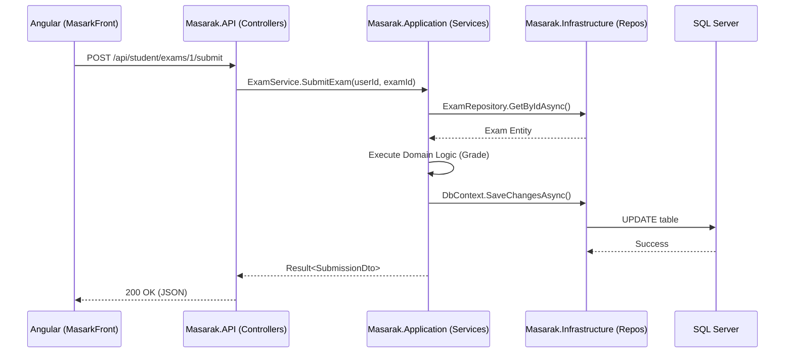

# Masarak Education Platform - Master Documentation

## Table of Contents
1. [Project Overview](#1-project-overview)
2. [Solution Structure](#2-solution-structure)
3. [Architecture & Design Patterns](#3-architecture--design-patterns)
4. [Communication & Data Flow](#4-communication--data-flow)
5. [Security, Auth & Authorization](#5-security-auth--authorization)
6. [Database & Infrastructure](#6-database--infrastructure)
7. [Complete Business Flow (Example)](#7-complete-business-flow-example)
8. [Recommended Improvements](#8-recommended-improvements)

---

## 1. Project Overview

### Purpose & Business Idea
**Masarak** is a comprehensive, multi-tenant Education Platform designed to bridge the gap between Students, Teachers, and Parents. It handles the entire lifecycle of an academic ecosystem:
- **Subscriptions**: Parents purchase plans and link them to their children.
- **Academic Core**: Scheduling classes, assigning teachers, and managing curriculum.
- **Assessment**: Creating, taking, and auto-grading exams and assignments.
- **Content & Live Classes**: Uploading study materials and hosting live video sessions (Agora) with real-time chat (SignalR).
- **AI Analytics**: Analyzing student weaknesses using LLMs and sending automated insights to parents.

### Technologies
- **Backend**: ASP.NET Core 9, Entity Framework Core 9 (SQL Server).
- **Frontend**: Angular 17+ (Standalone Components, Signals), TailwindCSS.
- **Infrastructure**: Azure Blob Storage (Files), Redis (Caching & SignalR Backplane), RabbitMQ & MassTransit (Event Bus), Stripe (Payments).
- **AI Integration**: OpenAI (GPT-4), Anthropic (Claude), Google (Gemini).

---

## 2. Solution Structure

The project is strictly divided into individual components based on Clean Architecture.

| Project / Layer | Responsibility | Detailed Docs |
|---|---|---|
| **`Masarak.Domain`** | Enterprise business rules, Entities, Enums, Domain Events. No dependencies. | [Domain Docs](./Masarak.Domain/documentation.md) |
| **`Masarak.Application`** | Application Use Cases, DTOs, Service Interfaces. | [Application Docs](./Masarak.Application/documentation.md) |
| **`Masarak.Infrastructure`** | Database, EF Core, Repositories, RabbitMQ, 3rd-Party APIs. | [Infrastructure Docs](./Masarak.Infrastructure/documentation.md) |
| **`Masarak.API`** | REST Controllers, JWT Middleware, SignalR Hubs. | [API Docs](./Masarak.API/documentation.md) |
| **`MasarkFront`** | The Angular 17 SPA for all user roles. | [Frontend Docs](./MasarkFront/documentation.md) |

---

## 3. Architecture & Design Patterns

### Domain-Driven Design (DDD)
- **Rich Entities**: Entities like `Exam` and `Subscription` control their own state. Properties have `private set`.
- **Value Objects**: Types like `AcademicYear` and `Money` ensure structural equality.
- **Domain Events**: Handled via MediatR. When an `Exam` is graded, it raises an `ExamGradedEvent` rather than calling the Notification service directly.

### CQRS & Repository Pattern
- All database access is abstracted behind specific interfaces (e.g., `IExamRepository`).
- Write operations mutate Entities and call `SaveChangesAsync()`.
- Read operations (Queries) often use `.AsNoTracking()` to project directly into DTOs for maximum performance.

---

## 4. Communication & Data Flow

### How Frontend communicates with Backend
1. **HTTP REST**: Angular's `HttpClient` calls the `.API` controllers. All requests are intercepted by `AuthInterceptor` to attach the JWT.
2. **WebSockets (SignalR)**: Angular establishes persistent connections to `/hubs/chat` and `/hubs/notification` for real-time bidirectional communication.



---

## 5. Security, Auth & Authorization

### Authentication Flow
- Users authenticate via `POST /api/auth/login`.
- The backend validates BCrypt hashes and issues two tokens:
  1. **Access Token**: Short-lived (e.g., 2 hours). Contains Claims (UserId, Role).
  2. **Refresh Token**: Long-lived (e.g., 30 days). Stored in the DB.
- Angular stores these tokens in `localStorage`. If an Access Token expires, the `ErrorInterceptor` automatically catches the 401 and calls `/api/auth/refresh` silently.

### Authorization Flow
- **Role-Based**: Controllers use `[Authorize(Roles = "Teacher")]`.
- **Policy-Based**: For complex checks (e.g., "Parent can only view reports for linked children"), `AppPolicies.cs` defines rules that evaluate request parameters against DB records.
- **Subscription-Based**: `SubscriptionAccessMiddleware` globally checks if a Student's subscription is `Active` before letting them hit premium endpoints. Returns HTTP 402 if expired.

---

## 6. Database & Infrastructure

### Database Schema
- **Relational DB**: SQL Server accessed via EF Core 9.
- **Migrations**: Stored in `Infrastructure/Persistence/Migrations`. Applied sequentially.
- **Soft Delete**: Not applied globally. Only specific entities (`User`, `ContentItem`, `ChatMessage`) have an `IsActive` or `IsDeleted` flag. Other tables use hard deletes with Cascade rules.

### Message Broker (RabbitMQ)
Used to decouple heavy processes.
- Example: When `IUnitOfWork.SaveChanges()` commits, MediatR dispatches Domain Events. `Phase5Consumers.cs` (MassTransit) listens for `ExamGradedEvent` and triggers a heavy LLM call to OpenAI in the background, freeing up the HTTP thread instantly.

---

## 7. Complete Business Flow (Example)

**Feature: Teacher Creates an Exam, Student Submits It, Parent gets Notified.**

```mermaid
graph TD
    %% Teacher creates exam
    T_UI[Teacher clicks 'Create Exam'] -->|POST /exams| API_C[TeacherAssessmentController]
    API_C --> APP_S[AssessmentService]
    APP_S --> DB_W[SQL Server: INSERT Exam]

    %% Student Takes Exam
    S_UI[Student takes Exam] -->|POST /submit| API_S[StudentAssessmentController]
    API_S --> APP_S2[AssessmentService.Grade()]
    APP_S2 --> DB_W2[SQL Server: UPDATE StudentExam]
    
    %% Event Publishing
    DB_W2 -->|EF Interceptor| EVT[Publish: ExamGradedEvent]
    
    %% Background Processing
    EVT -->|RabbitMQ| AI_CONS[Phase5 AI Consumer]
    AI_CONS -->|HTTP API| GPT[OpenAI GPT-4]
    GPT -->|Weakness Analysis| DB_W3[SQL Server: INSERT AiRecommendation]
    
    EVT -->|RabbitMQ| NOTIF_CONS[Phase6 Notification Consumer]
    NOTIF_CONS -->|SignalR| P_UI[Parent sees Notification]
```

---

## 8. Recommended Improvements

### 1. Code & Architecture Improvements
- **CQRS Refactoring**: Move away from monolithic `Application Services` and fully implement MediatR `IRequestHandler` for every single command/query. This isolates logic further.
- **Caching Strategy**: The `ICacheService` (Redis) is present but underutilized. Add caching decorators for heavy read queries (like `TeacherDashboardController`).

### 2. Performance Improvements
- **Database Indexing**: Ensure compound indexes exist on foreign keys frequently queried together (e.g., `TeacherId` + `AcademicYear`).
- **Pagination**: Ensure *all* lists (especially Chat Messages and Notifications) enforce strict `PageSize` limits.

### 3. Security Improvements
- **Rate Limiting**: Add ASP.NET Core Rate Limiting Middleware (`UseRateLimiter`) on the `/api/auth/login` and LLM-triggering endpoints to prevent brute force and AI billing exhaustion.
- **Key Vault**: Ensure all secrets (Stripe Keys, JWT Secret, OpenAI Keys) are migrated to Azure Key Vault and not stored in `appsettings.json` locally.

### 4. Clean Code
- **Mapster/AutoMapper**: Standardize DTO mapping. Remove any manual mapping logic from Controllers.
- **Strict Linting**: Implement ESLint/Prettier on Angular and Roslyn Analyzers/StyleCop on .NET to enforce formatting across the team of 6 developers.
